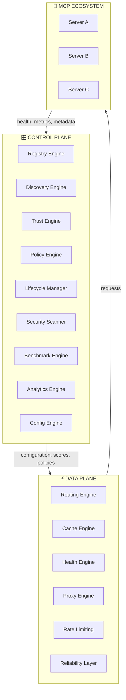
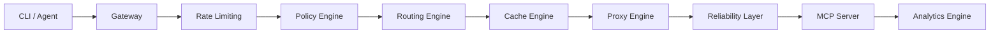
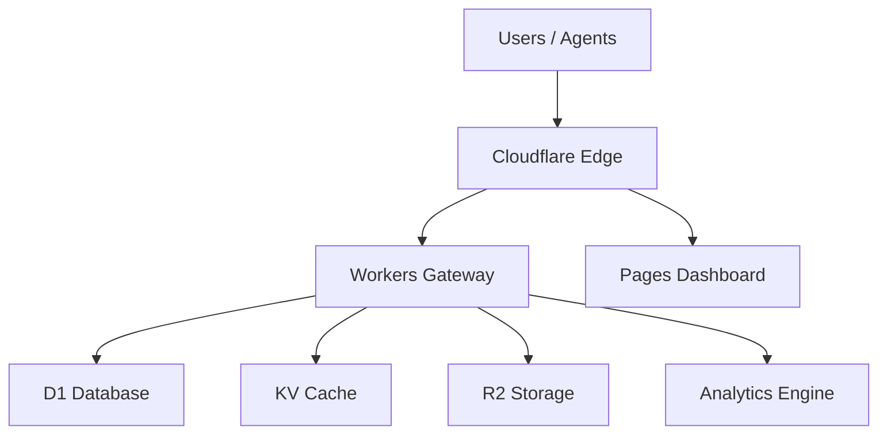

# MetaMesh-UGA — Architecture Overview

> Version 1.0 — 2026-06-25

---

## Vision

MetaMesh-UGA is the **MCP Operating System** — a universal control plane for AI agents and MCP infrastructure.

It transforms a fragmented ecosystem of thousands of MCP servers into a curated, trusted, and observable platform accessible through a single endpoint.

---

## High-Level Architecture

MetaMesh-UGA is organized into a **Control Plane** and a **Data Plane**, separated for scalability, resilience, and clarity.



---

## Control Plane

The Control Plane makes decisions, stores configuration, and manages the lifecycle of MCP servers.

### Registry Engine

- **Registry Sync**: automatic sync with official MCP registry every 6 hours
- **Registry Federation**: aggregate multiple registries (Smithery, MCP.so, private)
- **Registry Mirroring**: replicate registries across regions for HA
- **Registry Snapshot**: point-in-time snapshots for rollback
- **Offline Mode**: operate without internet connectivity

Package: `packages/registry/`

### Discovery Engine

- **Keyword search**: `GET /v1/tools?category=ai`
- **Semantic search**: vector-based search using name/description/capabilities
- **Capability graph**: relationship graph between capabilities
- **Intent search**: classify user intent and map to capabilities

Package: `packages/discovery/`

### Trust Engine

Computes a trust score for each MCP server based on:

| Component | Weight | Source |
|-----------|--------|--------|
| uptime | 0.20 | health checks |
| latency | 0.15 | benchmark engine |
| success_rate | 0.05 | analytics engine |
| popularity | 0.10 | usage analytics |
| security | 0.15 | security scanner |
| update_frequency | 0.10 | registry |
| maintainer_activity | 0.10 | GitHub API |
| issue_frequency | 0.05 | GitHub API |
| dependency_freshness | 0.05 | security scanner |
| compatibility | 0.05 | compatibility engine |

Package: `packages/trust/`

### Policy Engine

- OPA/Rego-based policy evaluation
- RBAC and per-tenant isolation
- Audit trail for all policy decisions

Package: `packages/policy/`

### Lifecycle Manager

Automates the lifecycle of an MCP server:

```
DISCOVERED → VALIDATED → VERIFIED → BENCHMARKED → RANKED → ACTIVE → DEPRECATED → ARCHIVED
```

Package: `packages/lifecycle/`

### Security Scanner

- Dependency scan (npm audit / Snyk / Trivy)
- CVE lookup
- Malware detection
- Permission analysis
- Network and filesystem access analysis

Package: `packages/security/`

### Benchmark Engine

Runs nightly benchmarks on every MCP server:

- startup time
- response time (p95)
- memory usage
- reliability (success rate)
- throughput (RPS)

Package: `packages/benchmark/`

### Analytics Engine

- Usage trends
- Latency and error trends
- Cost analysis
- Provider trends
- Export to OpenTelemetry and Prometheus

Package: `packages/analytics/`

### Config Engine

- Distributed configuration
- Feature flags
- Per-tenant settings

Package: `packages/config/`

---

## Data Plane

The Data Plane executes requests in real time.

### Routing Engine

Routing strategies:

- **weighted**: traffic distribution based on weights
- **latency**: route to the fastest server
- **geographic**: route to the nearest region
- **cost**: route to the cheapest server meeting constraints
- **health**: route only to healthy servers

Package: `packages/gateway/src/routing/`

### Cache Engine

- Multi-level edge cache (Cloudflare KV + R2)
- TTL and invalidation
- Tool schema and metadata caching

Package: `packages/gateway/src/cache/`

### Health Engine

- Real-time health checks
- Health state aggregation
- Unhealthy server eviction

Package: `packages/health/`

### Proxy Engine

- MCP protocol proxy
- SSE and JSON-RPC handling
- Request/response transformation

Package: `packages/gateway/src/proxy/`

### Rate Limiting

- Per-tenant limits
- Plan-based quotas
- Token bucket algorithm

Package: `shared/src/ratelimit.js`

### Reliability Layer

- Exponential retry
- Circuit breaker
- Bulkhead isolation
- Request hedging
- Adaptive timeout

Package: `packages/gateway/src/reliability/`

---

## Communication Flow

### Discovery Pipeline


### Request Pipeline



---

## Deployment Architecture

MetaMesh-UGA runs on Cloudflare:

- **Workers**: serverless compute for Control Plane and Data Plane
- **D1**: relational database for catalog, usage, policies, lifecycle
- **KV**: edge cache and rate limiting state
- **R2**: WASM modules, snapshots, invoices
- **Analytics Engine**: metrics and observability
- **Pages**: dashboard and landing



---

## Scalability Targets

- Control Plane and Data Plane scale independently
- Data Plane continues serving requests even if Control Plane is unavailable
- Each engine can be deployed as a separate worker or consolidated

---

## Security Model

See [docs/SECURITY_MODEL.md](SECURITY_MODEL.md).

---

*Last updated: 2026-06-25*
